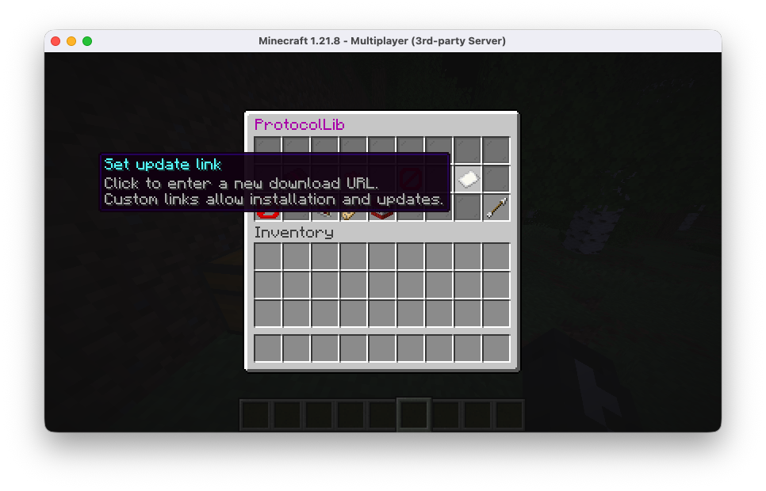
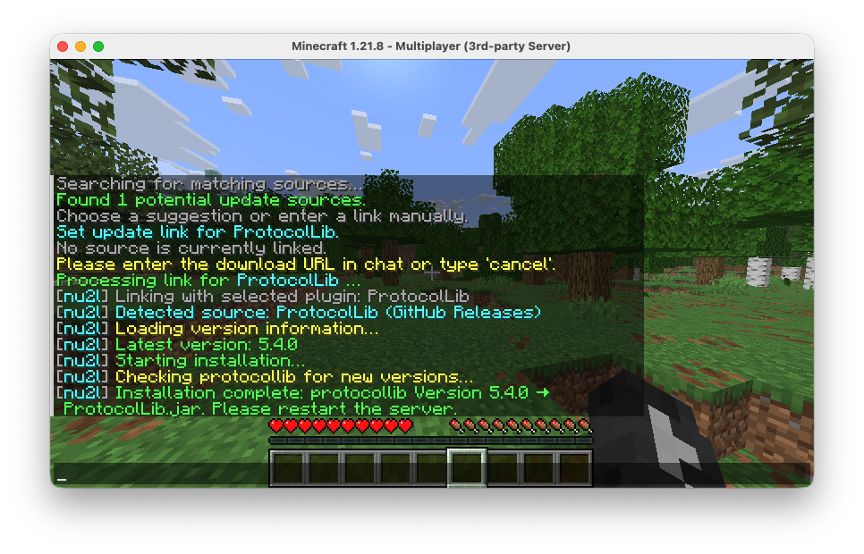
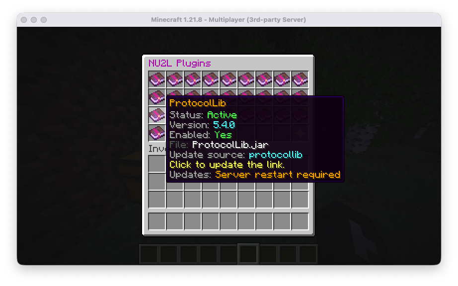
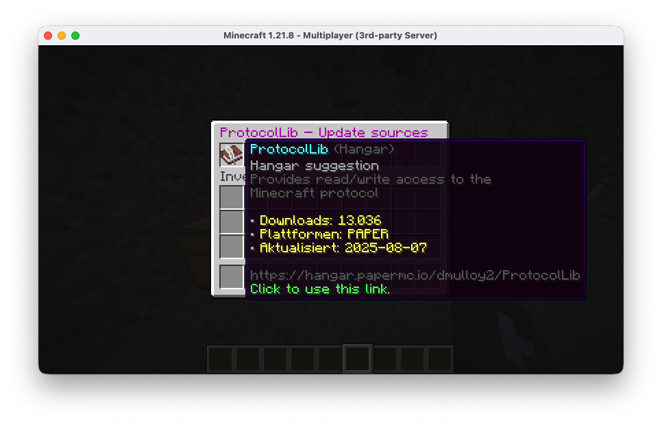
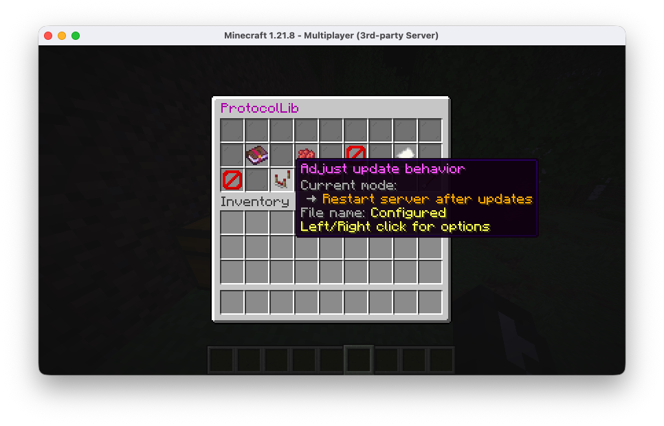

# NeverUp2Late

NeverUp2Late keeps your Paper-based Minecraft server and its plugins permanently up to date. The plugin monitors all configured
sources on a schedule, downloads the most recent builds, replaces outdated JARs, and optionally reloads or restarts the server
once installations complete. You can manage update sources through YAML configuration, an interactive GUI, or the `/nu2l`
command that understands direct project URLs from popular hosting platforms such as Hangar, Modrinth, GitHub Releases, Jenkins,
and SpigotMC via the Spiget API.

## Highlights

- **Automated update pipeline** – Fetch, download, and installation steps run asynchronously with retry logic and persistent
  state tracking to avoid redundant downloads.
- **Wide provider support** – Built-in fetchers cover Paper, Geyser, Hangar, Modrinth, CurseForge, GitHub Releases, Jenkins,
  SpigotMC via the Spiget API, and fully custom implementations supplied by class name.
- **Quick installation** – `/nu2l <url>` analyses Hangar, Modrinth, GitHub, Jenkins, and SpigotMC/Spiget links, creates an update source on the
  fly, and immediately schedules the first installation run.
- **Archive-aware downloads** – Releases that ship ZIP files can be inspected automatically; NeverUp2Late extracts the matching
  JAR from the archive or asks you to select the correct entry when multiple candidates exist.
- **Interactive server GUI** – `/nu2l` without arguments opens a chest-based interface for linking update sources with plugins,
  changing per-plugin behaviour, renaming files, toggling updates, or launching manual searches.
- **First-run setup wizard** – Operators with `neverup2late.setup` are guided through an in-game onboarding flow that explains
  defaults, lets you review detected plugins, and activates the scheduler once finished.
- **Lifecycle automation** – When enabled, NeverUp2Late reloads updated plugins or restarts the server after respecting a
  cooldown timer, so changes become active without manual intervention.

## Installation

1. Download the latest release from the [SpigotMC resource page](https://www.spigotmc.org/resources/neverup2late-automatically-keeps-paper-geyser-up-to-date.120768/history).
2. Copy `NeverUp2Late.jar` into the `plugins` directory of your Paper (or compatible) server.
3. Start the server once so `config.yml`, state files, and the optional GUI resources are generated.
4. Adjust `plugins/NeverUp2Late/config.yml` to fit your environment.
5. Operators can complete the interactive setup wizard or open the GUI via `/nu2l` to review detected sources.

### Requirements

- Minecraft server implementing the Bukkit API (Paper recommended) for Minecraft 1.21 or newer.
- Java 17 or higher (matching the Paper 1.21 baseline).

## First-Time Setup

On first launch the plugin stays in setup mode until an operator completes the wizard. Eligible players receive a chat prompt and
an inventory interface that walks through:

1. Reviewing automatically created Paper and Geyser sources (legacy defaults).
2. Picking target directories (`server` or `plugins`) and filenames.
3. Confirming whether to restart immediately or later.

When the wizard finishes, NeverUp2Late records the completion status and starts the scheduled update loop. You can reopen the
wizard at any time with `/nu2l setup` while setup mode is active. Server operators can now complete the onboarding headlessly via
`/nu2l setup complete` from the console, or apply a prepared configuration file with `/nu2l setup apply <file>`.

To skip the wizard entirely on fresh installations, set `setup.skipWizard: true` in `config.yml`. The plugin will immediately
persist the default sources and start update checks.



## Commands

| Command | Description | Permission | Notes |
|---------|-------------|------------|-------|
| `/nu2l` | Opens the plugin overview GUI. | `neverup2late.gui.open` | Requires a player; shows managed plugins and install actions. |
| `/nu2l gui` | Explicitly opens the GUI. | `neverup2late.gui.open` | Alias for `/nu2l`. |
| `/nu2l status` | Lists configured update sources with their target path, stored build/version, and auto-update flag. | `neverup2late.install` | Works for players and console; read-only overview. |
| `/nu2l <url>` | Runs quick installation for the provided URL. | `neverup2late.install` | Works from console or in-game; URLs must use HTTP(S) and can target Hangar, Modrinth, GitHub Releases, Jenkins, or SpigotMC/Spiget resources. |
| `/nu2l select <number>` | Chooses an asset when multiple files are available. | `neverup2late.install` | Responds to prompts generated during quick install. |
| `/nu2l remove <name>` | Unregisters an update source and stops managing its file. | `neverup2late.gui.manage.remove` | Available from console and players. |
| `/nu2l setup` | Opens the first-run setup wizard. | `neverup2late.setup` | Players only; shows if setup is not completed. |
| `/nu2l setup complete` | Stores default sources and marks setup as finished without opening the GUI. | `neverup2late.setup` | Works from console or in-game. |
| `/nu2l setup apply <file>` | Loads update sources from a YAML file and finalises setup. | `neverup2late.setup` | File paths are resolved relative to the plugin folder (`setup-presets/<file>.yml` is also checked). |

### Permission Overview

```
neverup2late.setup             # Access to the setup wizard
neverup2late.install           # Use /nu2l <url>, /nu2l status, and manage quick installs
neverup2late.gui.open          # Open the GUI
neverup2late.gui.manage        # Grant all GUI management permissions
neverup2late.gui.manage.lifecycle
neverup2late.gui.manage.link
neverup2late.gui.manage.settings
neverup2late.gui.manage.rename
neverup2late.gui.manage.remove
```

Default operators receive all permissions listed above.

#### Example `/nu2l status` output

```
Update source status:
• paper → /home/mcserver/paper.jar | Version 1.21.1 (Build 123) | Auto-Update: enabled | Plugin: Paper
• geyser → /home/mcserver/plugins/Geyser-Spigot.jar | No installation recorded | Auto-Update: disabled | Plugin: unassigned
```

The command prints colour-coded lines in-game and plain text in the console, so administrators can quickly verify what NeverUp2Late is managing without opening the GUI.

## Quick Install Workflow

1. **Analyse the URL** – NeverUp2Late parses Hangar, Modrinth, GitHub Releases, Jenkins, and SpigotMC/Spiget project URLs, derives a readable name,
   and prepares provider-specific options.
2. **Link to an installed plugin** – The coordinator tries to match the download with an existing plugin to reuse version metadata
   for smarter update checks.
3. **Fetch latest build info** – Version metadata and download URLs are loaded asynchronously; the chat shows progress and detected
   version numbers.
4. **Resolve compatibility warnings** – If the provider does not advertise support for your Minecraft version, the workflow pauses
   and asks whether to ignore the warning. Use `/nu2l ignore` to proceed with the newest build or `/nu2l cancel` to abort the
   installation.
5. **Handle archives or multiple assets** – If the release exposes several files or zipped distributions, the player is prompted to
   pick the desired asset or JAR inside the archive; regex patterns are stored automatically for future updates.
6. **Schedule installation** – Once information is complete, the update handler copies the build into the configured directory and
   applies lifecycle rules (reload or restart).



## Graphical Interface

The GUI mirrors all managed plugins and update sources in a paginated chest inventory. From here you can:

- Inspect plugin status (loaded, disabled, pending reload) at a glance.
- Enable, disable, load, or unload plugins when lifecycle management is active.
- Link existing plugins to update sources or accept automatic suggestions from Modrinth/Hangar search.
- Adjust per-plugin settings such as automatic updates, restart requirements, and filename retention (writes to `plugin-settings.yml`).
- Initiate quick installs or manual searches without leaving the interface.







If lifecycle management is disabled in the configuration, the GUI still lists update sources but hides actions that require
reloading plugins.

## Configuration

All configuration lives in `plugins/NeverUp2Late/config.yml`. The default layout looks like this:

```yaml
setup:
  skipWizard: false

filenames:
  geyser: "Geyser-Spigot.jar"
  paper: "paper.jar"

updateInterval: 180
pluginLifecycle:
  autoManage: true
quickInstall:
  ignoreCompatibilityWarnings: false

updates:
  ignoreUnstable: true
  sources:
    - name: paper
      type: paper
      target: server
      filename: "paper.jar"
    - name: geyser
      type: geyser
      target: plugins
      filename: "Geyser-Spigot.jar"
```

Key options:

- `setup.skipWizard` – When `true`, NeverUp2Late skips the interactive wizard and applies default sources on startup.
- `updateInterval` – Minutes between scheduled update checks (default: 180 minutes / 3 hours).
- `pluginLifecycle.autoManage` – Enables automatic plugin reloads and lifecycle controls. Set to `false` to keep manual restarts.
- `quickInstall.ignoreCompatibilityWarnings` – When `true`, the quick install workflow skips Minecraft-version compatibility
  checks reported by providers like Modrinth and installs the latest build regardless.
- `filenames.<name>` – Default filename for a source if `updates.sources[].filename` is omitted.
- `updates.ignoreUnstable` – Global default for filtering unstable/prerelease builds; individual sources can override it.
- `updates.sources` – Array of source descriptors, each providing `name`, `type`, `target` (`server` or `plugins`), optional
  `filename`, and an `options` block for provider-specific settings.

### Provider-Specific Options

| Type | Notable `options` |
|------|-------------------|
| `paper` | No additional fields required; auto-detects the installed Minecraft version. Supports `ignoreUnstable` / `allowUnstable` overrides and `minimumUnstableBuild` (default `50`) to delay prerelease builds until a specific build number is reached. |
| `geyser` | Preconfigured Modrinth integration with required build numbers; usually needs no extra options. |
| `hangar` | Specify `owner` + `slug` or `project`. Optional: `platform`, `allowedChannels`, `ignoreUnstable` / `allowUnstable`, `requireReviewed`, `preferPinned`, `pageSize`, `maxPages`, and `installedPlugin` for version detection. |
| `modrinth` | Provide `project`; optionally filter by `loaders`, `statuses`, `versionTypes`, `gameVersions`, or `preferPrimaryFile`. `installedPlugin` links to an existing plugin. |
| `curseforge` | Requires `modId`. Optional rate-limit friendly `apiKey`, release type filters, game versions, and `installedPlugin`. |
| `spigot` | Requires `resourceId` from the SpigotMC URL. Optional: `preferredGameVersions` (list), `ignoreCompatibilityWarnings`, and `installedPlugin` for version lookups via the running server. |
| `githubRelease` | Needs `owner` and `repository`; supports `assetPattern`, `allowPrerelease`, `archiveEntryPattern`, and `installedPlugin` for archive extraction and version checks. |
| `jenkins` | Configure `baseUrl` and `job`. Additional keys control artifact selection (`artifact`, `artifactPattern`), preferred build (`preferLastSuccessful`), and version parsing (`versionSource`, `versionPattern`, `installedPlugin`). |
| Custom class | Set `type` to the fully qualified class name of your `UpdateFetcher` implementation; all `options` values are passed to the constructor. |

### Per-Plugin Behaviour (`plugin-settings.yml`)

NeverUp2Late writes individual preferences to `plugins/NeverUp2Late/plugin-settings.yml` whenever you tweak settings through the
GUI or API.

- `autoUpdate` – Toggle automatic update checks per plugin; disabling prevents scheduled downloads but manual runs still work.
- `behaviour` – Choose between `AUTO_RELOAD` (try to hot-reload after updates) and `REQUIRE_RESTART` (defer to server restart).
- `retainUpstreamFilename` – Preserve the upstream filename instead of renaming it to the configured target name.

## Update Cycle and Lifecycle Handling

The update handler continuously iterates over registered sources:

1. **Fetch metadata** – Each fetcher loads the latest build number and version string. Results are cached in `plugins.yml` to avoid
   downloading identical builds again.
2. **Download artifacts** – Files are downloaded to a temporary location with retry logic and validated before being moved into the
   `server` or `plugins` directory.
3. **Install and notify** – After copying, the installation handler executes post-update actions: plugin reload attempts, file path
   updates, and optional server restarts (with a one-hour cooldown that persists across restarts).
4. **Lifecycle decisions** – If no players are online when an update finishes, actions run immediately; otherwise they are deferred
   until the server empties to avoid interrupting active sessions.

## Persistence Layer

NeverUp2Late stores multiple files under `plugins/NeverUp2Late/`:

- `plugins.yml` – Tracks the last installed build and version per update source to prevent redundant downloads.
- `plugin-settings.yml` – Remembers per-plugin preferences such as automatic updates and restart behaviour.
- `setup-state.yml` – Records the current setup phase so the onboarding wizard only appears when needed.
- `restart-cooldown.json` – Maintains the timestamp of the last automatic restart to enforce the cooldown.

## Troubleshooting Tips

- Use the console log at `FINE` level to inspect fetcher creation and lifecycle decisions; NeverUp2Late logs misconfigured sources
  and disabled lifecycle management prominently.
- If quick install cannot determine the correct asset, rerun `/nu2l select <number>` or configure `assetPattern` /
  `archiveEntryPattern` manually in `config.yml` to persist the desired file match.
- Lifecycle automation can be disabled entirely by setting `pluginLifecycle.autoManage: false` when you prefer manual restarts.

## License

NeverUp2Late is released under the GNU General Public License v3.0.
